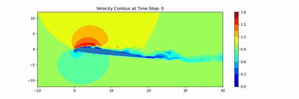

# Tecplot Data Visualization in Python
Tecplot 360 is a numerical simulation software package used in post-processing simulation results. The software is widely used in engineering domain(fluid flow solver, engineering stress program, heat flow program, etc.), which support various output data format from finite volume or finite element solver. For example, a flow solver focus on the numerical solution of [Navier-Stokes equations](https://en.wikipedia.org/wiki/Navier%E2%80%93Stokes_equations) and makes prediction of state variable (fluid density, velocity and energy) at each time step.
 
The currently studied output data files [text-based DAT(ASCII) files](https://people.sc.fsu.edu/~jburkardt/data/tec/tec.html) (extention ".dat"), which is commenly used for numerical simulation code for engineering purpose. The data file usually contains multiple blocks for the purpose of parallel computing. In the context of unsteady simulation (time series prediction, but 3-dimensional in space), the data amount could be huge depending on the size of the problem.

The current simple script provides a pythonic view of a series of data file for Tecplot, through instantaneous slice and animation of contour. The flow pattern around an airfoil is shown in the example.

The pipeline is shown in `notebook/flow_visualization`, including:
- Data extraction
- Coutour plots for a given slice position
- Animation

The scripts of utility function are available in `scripts` folder. The entire process can be executed by `python scripts/main.py`